# School-Machine Design

School machine has a number of architectural components, each of which are small in enough in complexity to easily understand the domain aspects, and be to be easily implemented in multiple technologies, as new technologies appear.

The goal of this project is not create a fully functional web and mobile enabled application, but to identify the architectural components and patterns necessary to create a minimally viable product.

# SchoolMachine Entity Model

## SchoolData Schema

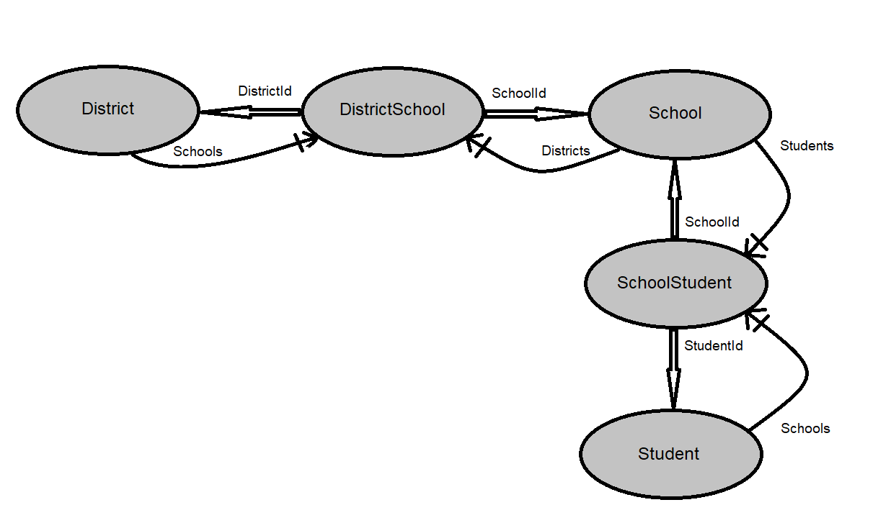

# Application Architectural Components

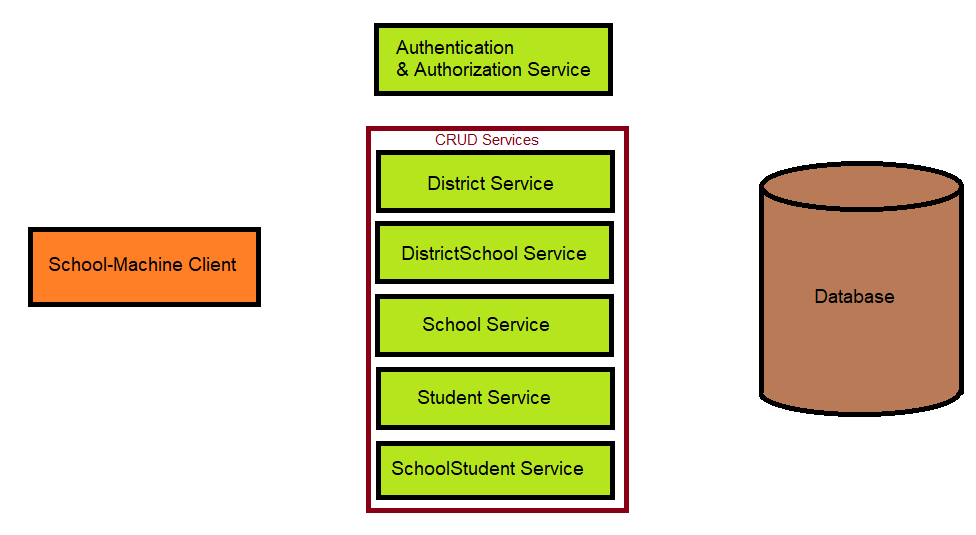

* School-Machine Client
* Authentication & Authorization Service
* District Service
* DistrictSchool Service
* School Service
* Student Service
* SchoolStudent Service
* Database

# SchoolMachine Security

## Security Schema

SchoolMachine is capable of servicing users of many types.  Each user is capable of performing many different roles, or tasks.  Each facet of SchoolMachine will be associated with a particular Role.  Roles may be assigned directly to a user, or may be assigned as a set to a Group.  Then Users may be assigned to groups.  Groups may be tailored for individual entities such as Districts, Schools, and Students.  Other user types will be added to SchoolMachine soon.

Below is the Security schema ojbect model.

# School-Machine Client Anatomy

The School-Machine client application will be implemented in multiple web development technology frameworks.  Currently, there are three technologies under study:

  | Framework  |  Repository | Version  | Status  |   |
|---|---|---|---|---|
|  Angular |  SchoolMachineUIAngular | 7  |  In Development |   |
|  React | schoolmachineuireact  |   | Very Rough Start  |   |
|  MVC/Razor |  na |  .net core 2.2 | Not Started  |   |
  

## App Module

The App module contains the menu component and the router.

## Child Components

### Menu

### Home

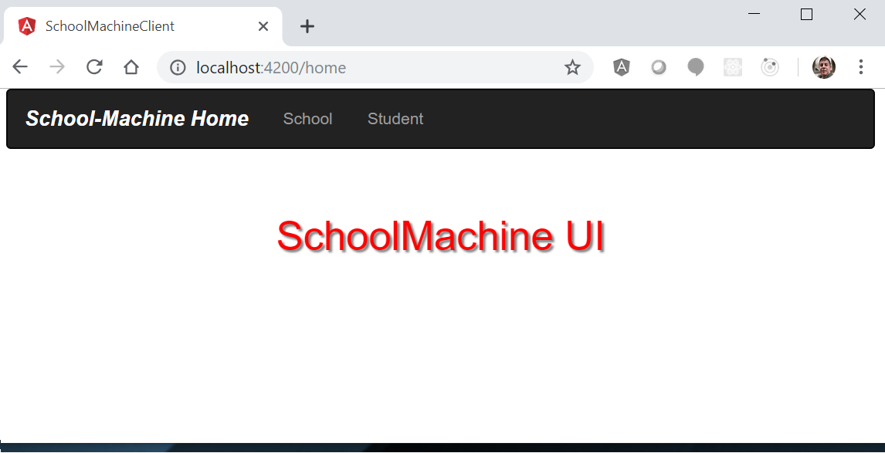

### District

* district-list

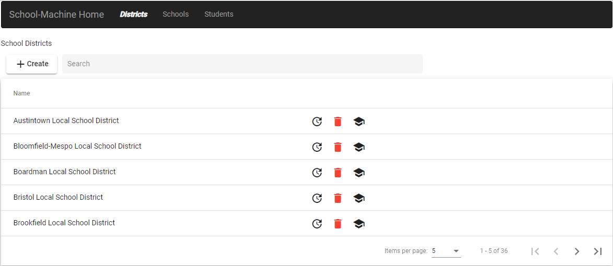

* district-create

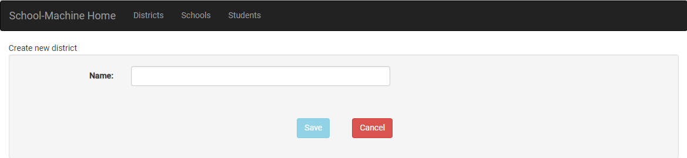

* district-update

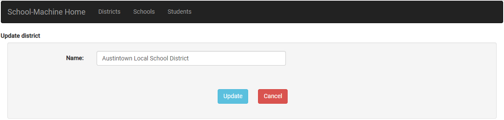

* district-delete

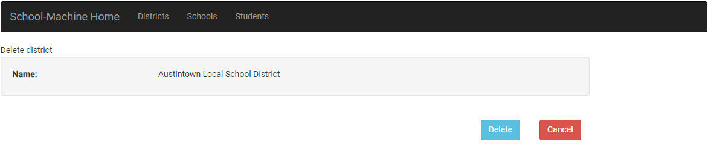

* district-details

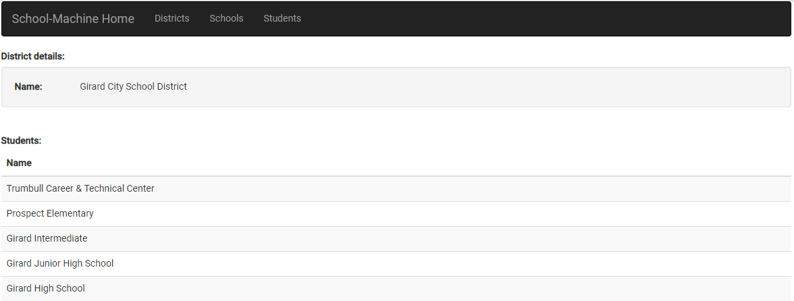

### School

* school-list

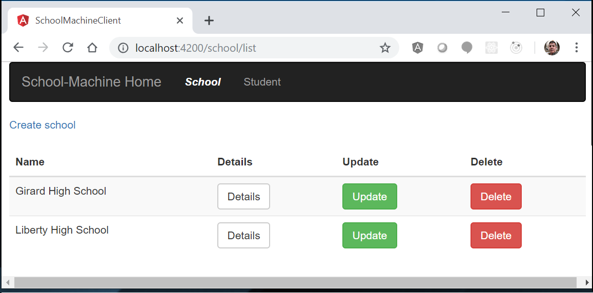

* school-create

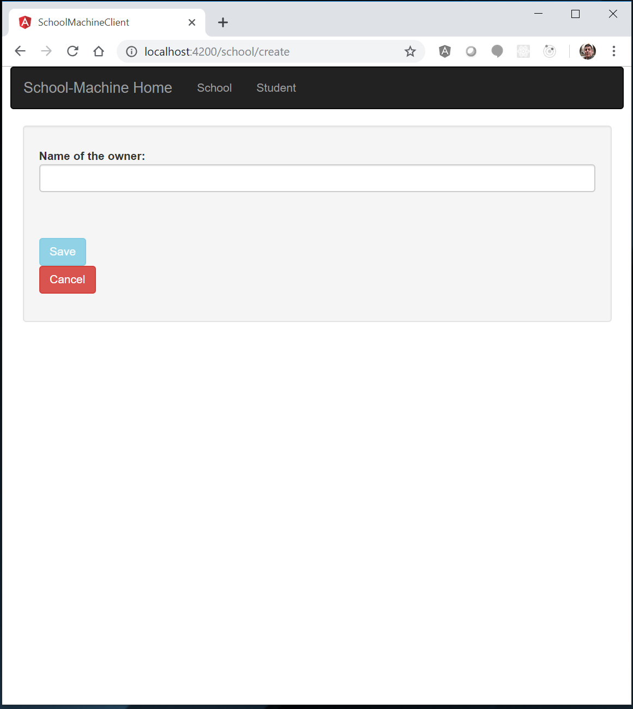

* school-delete

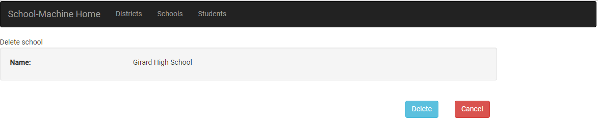

* school-details

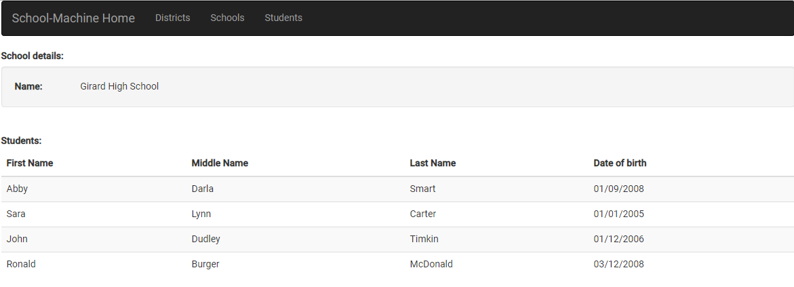

* school-update

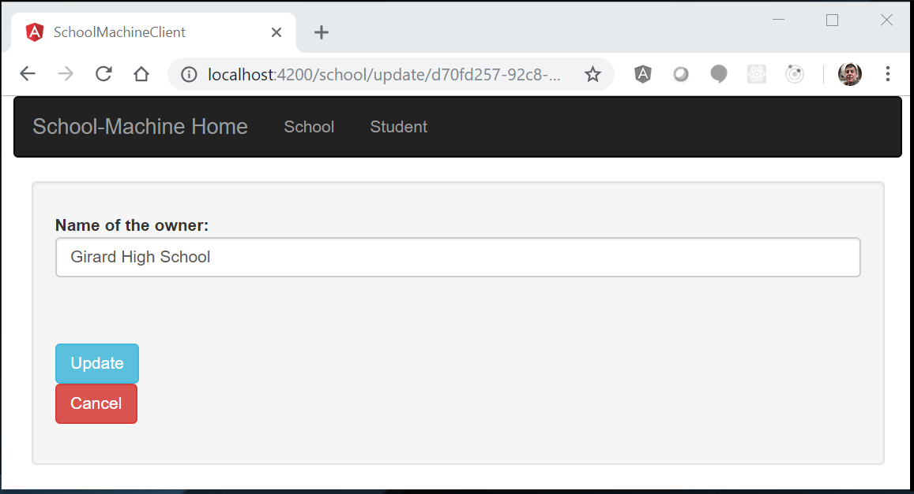

### Student

* student-list

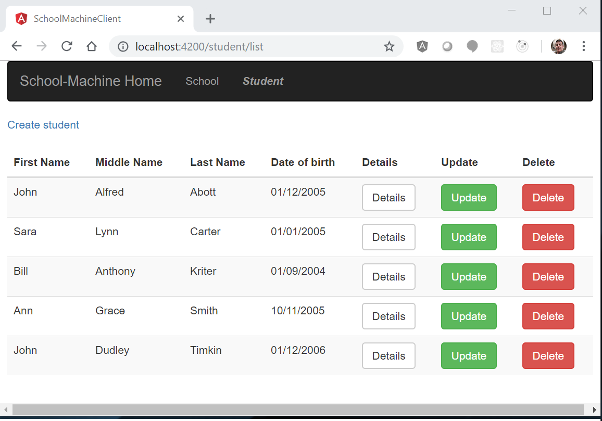

* student-create

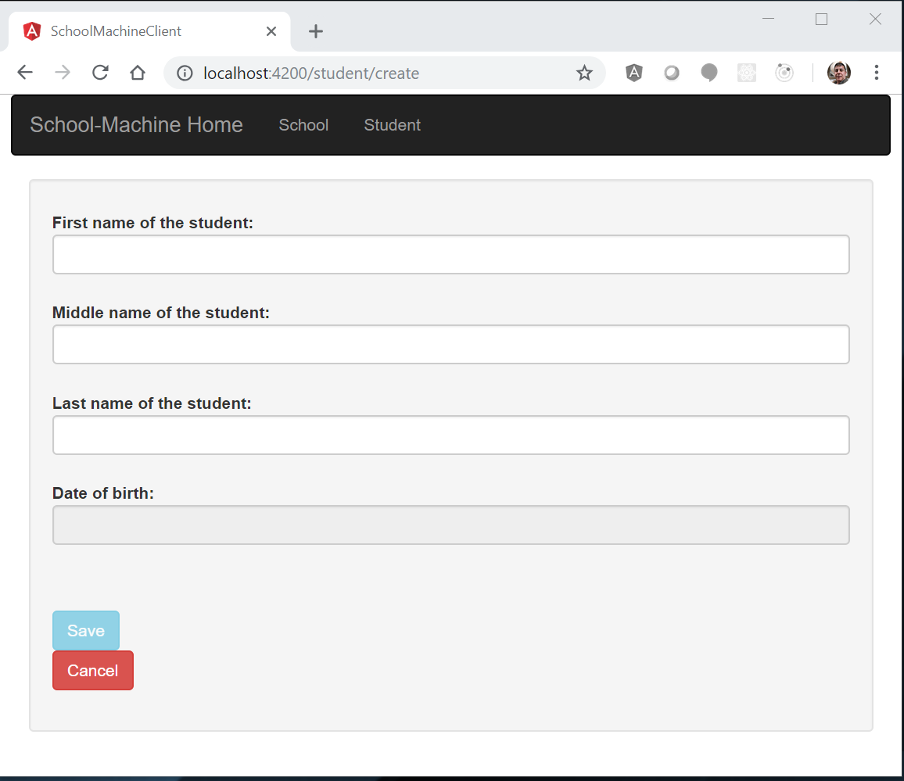

* student-details

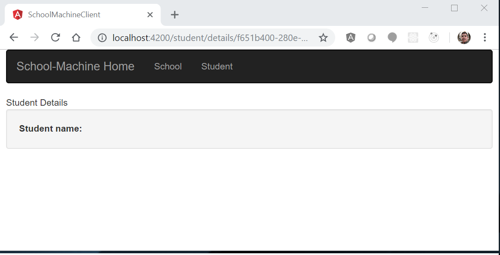

* student-delete

* student-update

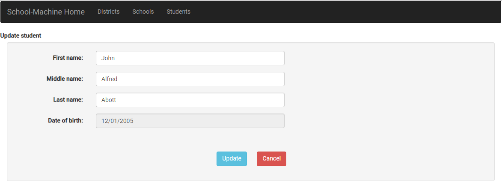

# School-Machine Web Services

* Swagger

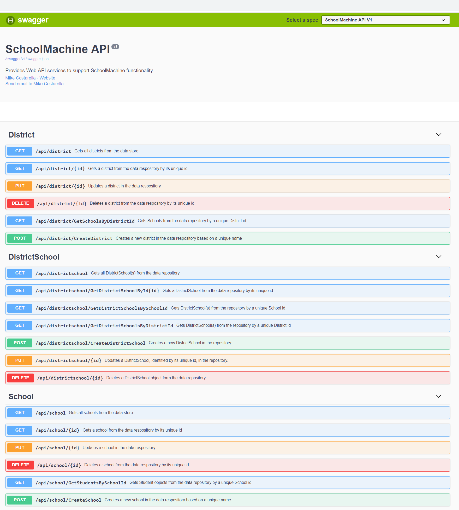

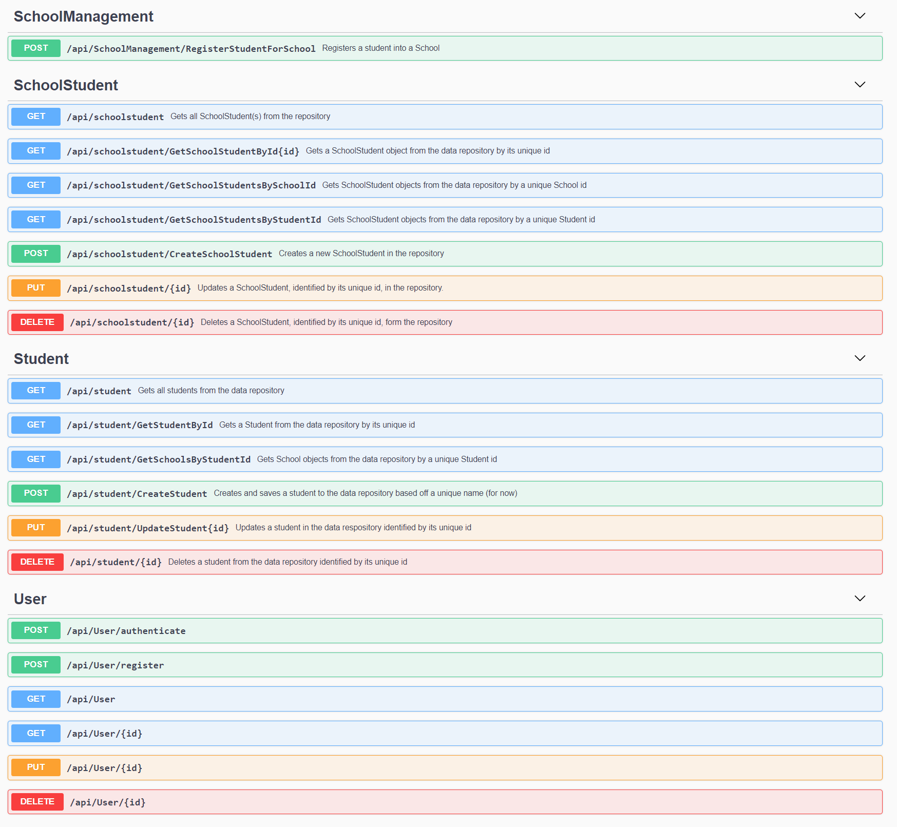