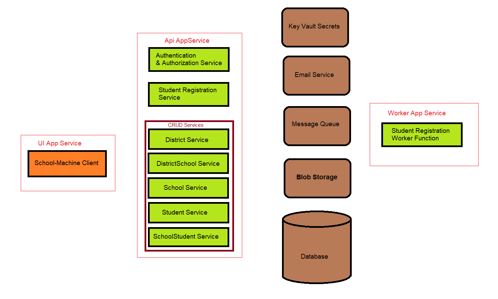
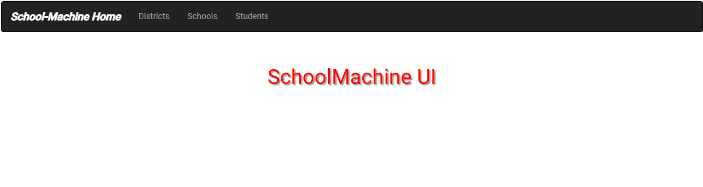
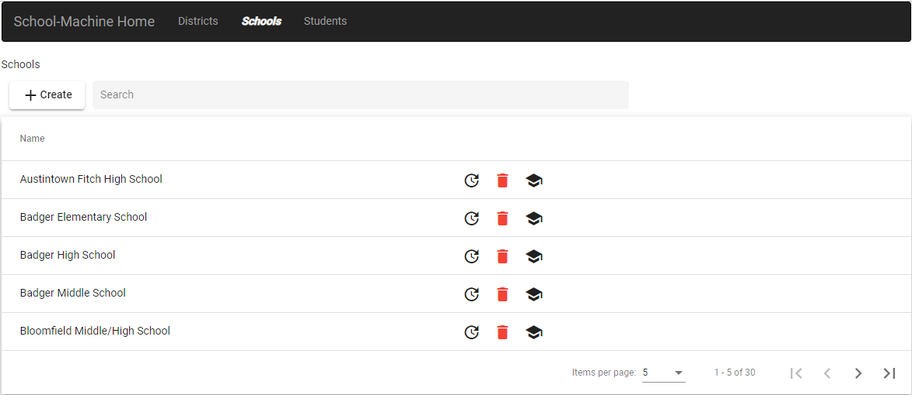
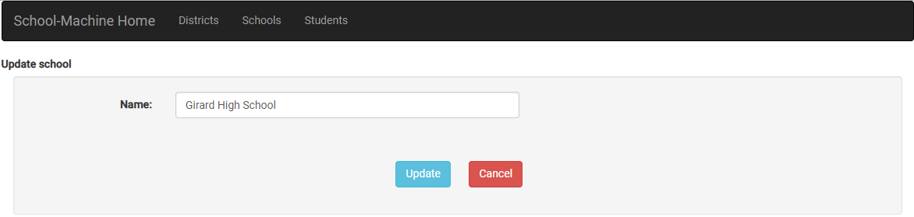
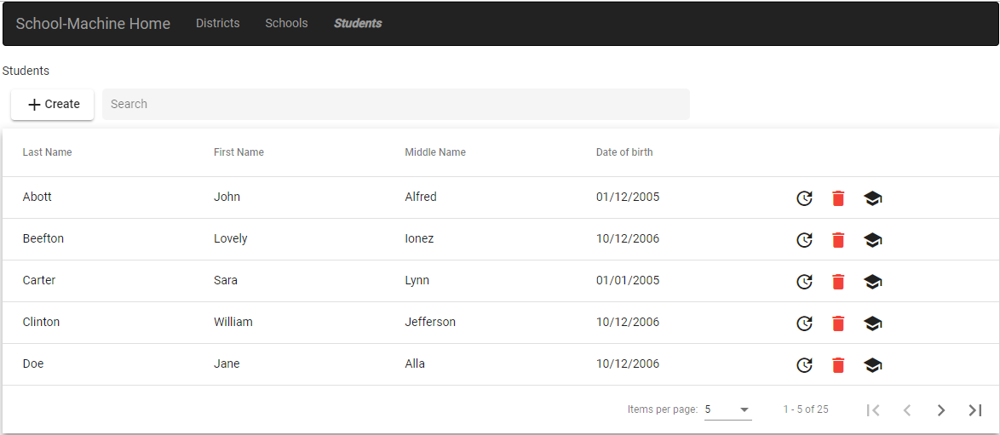
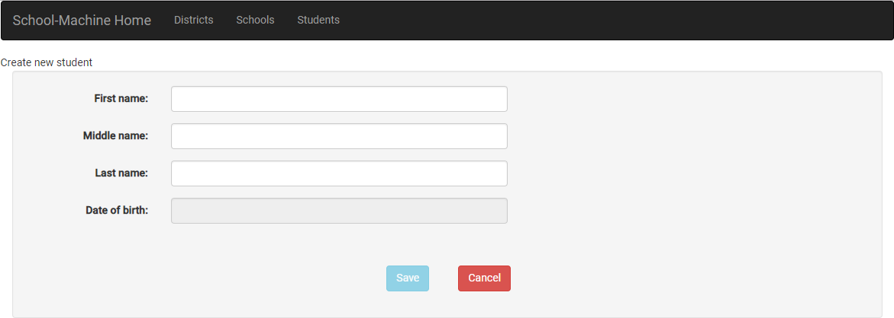
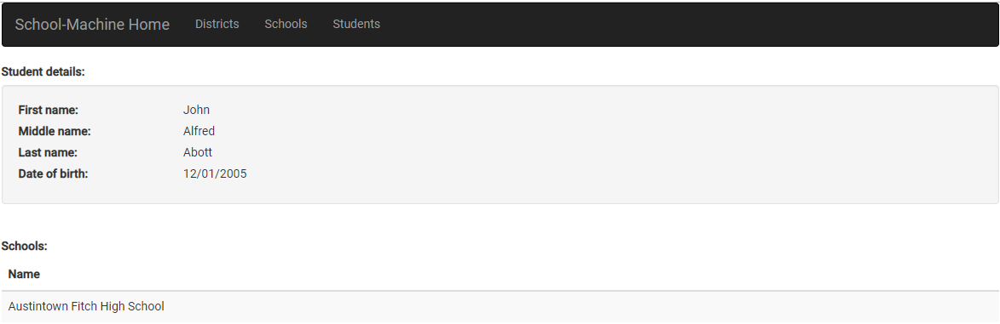

# School-Machine Design

School machine has a number of architectural components, each of which are small in enough in complexity to easily understand the domain aspects, and be to be easily implemented in multiple technologies, as new technologies appear.

The goal of this project is not create a fully functional web and mobile enabled application, but to identify the architectural components and patterns necessary to create a minimally viable product.

# SchoolMachine SchoolData Entity Model

# Application Architectural Components

* School-Machine Client
* Authentication & Authorization Service
* District Service
* DistrictSchool Service
* School Service
* Student Service
* SchoolStudent Service
* Database

# School-Machine Client Anatomy

The School-Machine client application will be implemented in multiple web development technology frameworks.  Currently, there are three technologies under study:

  | Framework  |  Repository | Version  | Status  |   |
|---|---|---|---|---|
|  Angular |  SchoolMachineUIAngular | 7  |  In Development |   |
|  React | schoolmachineuireact  |   | Very Rough Start  |   |
|  MVC/Razor |  na |  .net core 2.2 | Not Started  |   |
  

## App Module

The App module contains the menu component and the router.

## Child Components

### Menu

### Home

### School

* school-list

* school-create

* school-delete

* school-details

* school-update

### Student

* student-list

* student-create

* student-delete

* student-details

* student-update

# School-Machine Web Services

* Swagger

